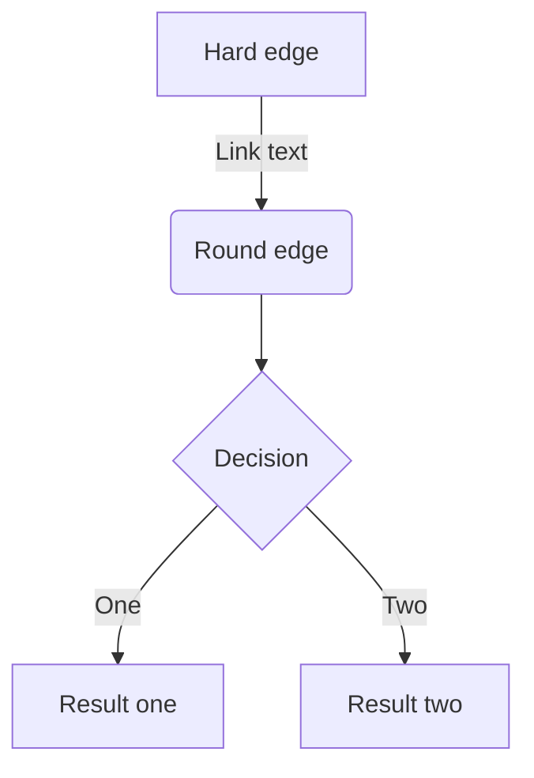
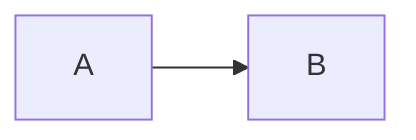

#tigergraph 教程
##简介：
tigergraph是一个图数据库
## 安装
\[
e^{i\pi} + 1 = 0
\]
### 下载
#### 解压
## 无序列表
- 托尔斯泰
- 特克斯县
- 泰凯斯
## 有序列表
1. 李恩
2. 李恩飞``
3. ak472
## 李恩飞

```java
class test implements Serializable {
  private static final long serialVersionUID = 42l;
  public static void main(String[] args) {
    System.out.println("hello world");
  }
}
```
```java
class MyClass extends Parent implements Interface {
  
}
```


| name | age | weight |
| ---- | --- | ------ |
| Jim  | 18  | 60     |
| Tom  | 22  | 70     |
|      |     |        |g
|      |     |        |
|      |     |        |
```python
def fname(arg):
  pass
```

> 一盏灯，一片昏黄，一简书，一杯淡茶。
>
> *一盏灯*，一片昏黄，**一简书**，一杯淡茶。

```javascript
function test() {
    console.info("markdown");
}
```
## 代码引用
`hello word`
## 多段代码引用
```python
import requests
def test() {

}
```
```shell
class A {
    public static void main(String[] args){
        #System.out.println("markdown");
    }
}
```


{#jumpid}
### 想要跳转到这里？

从页面的任何地方跳转到 [click](#jumpid "跳转到'想要跳转到这里？'")
##表格
|Tables|Are|cool|
|------|---|----|
|col 3 is|right-aligned|$1600|

![][1]
[1]: http://latex.codecogs.com/gif.latex?\prod%20\x = \dfrac{-b \pm \sqrt{b^2 - 4ac}}{
[Google](https://www.google.com)
[Baidu](https://www.baidu.com)


### LaTeX 公式

可以创建行内公式，例如 $\Gamma(n) = (n-1)!\quad\forall n\in\mathbb N$。或者块级公式：

$$  x = \dfrac{-b \pm \sqrt{b^2 - 4ac}}{2a} $$
$$ b^2 $$

### 表格
| Item      |    Value | Qty  |
| :-------- | --------:| :--: |
| Computer  | 1600 USD |  5   |
| Phone     |   12 USD |  12  |
| Pipe      |    1 USD | 234  |

### 流程图
```flow
st=>start: 开始
op=>operation: My Operation
cond=>condition: Yes or No?
e=>end
st->op->cond
cond(yes)->e
cond(no)->op
```




<script type='text/javascript' src='/public/jquery-2.1.3.min.js'><script>
<script src="http://cdnjs.cloudflare.com/ajax/libs/raphael/2.2.0/raphael-min.js"></script>
 <script src="http://flowchart.js.org/flowchart-latest.js"></script>
